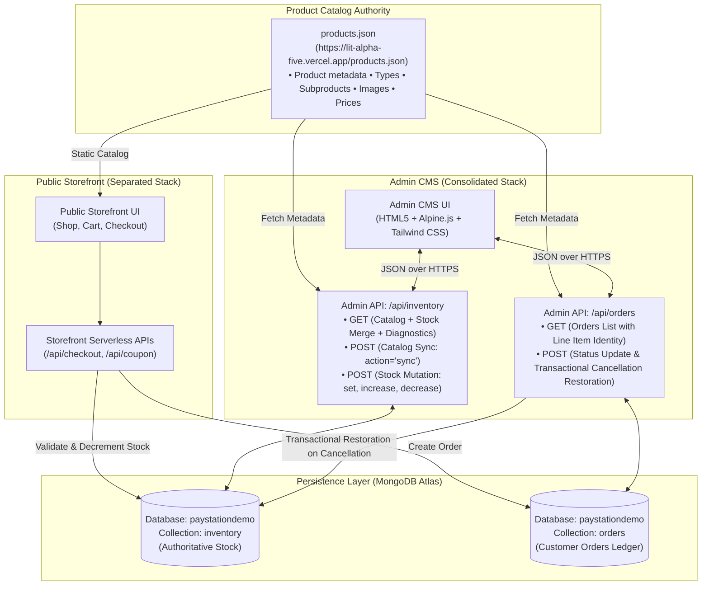
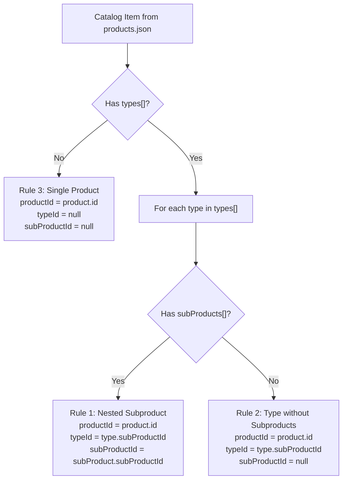

# Technical Requirements Document (TRD)
## Rawgad Admin CMS — Inventory & Orders Management System

**Document Version**: 2.2.0  
**Target Environment**: Vercel Serverless Functions & Node.js  
**Database**: MongoDB Atlas (`paystationdemo`)  
**Product Catalog Source**: `https://lit-alpha-five.vercel.app/products.json`  
**Frontend Stack**: Semantic HTML5 + Alpine.js 3.x + Tailwind CSS (No React)  

---

## 1. Executive Summary & System Architecture

### 1.1 Scope & Architecture Boundary
This Technical Requirements Document (TRD) defines the production data architecture, serverless API contracts, inventory synchronization algorithms, transactional cancellation stock restoration rules, and client UI specifications for the **Rawgad Admin Content Management System (CMS)**.

> **System Scope Note**: The Admin CMS backend is consolidated into exactly two canonical serverless endpoints: `/api/inventory` and `/api/orders`. The Public Storefront maintains its own decoupled serverless functions (such as `/api/checkout` and storefront stock validation). The Public Storefront API architecture and Admin CMS API architecture remain strictly separate while operating against the same MongoDB Atlas database and public catalog source.



### 1.2 Authoritative Source-of-Truth Rules
```text
Product Information  --> products.json (Public Site)
Physical Stock       --> MongoDB Atlas (paystationdemo.inventory)
Customer Orders      --> MongoDB Atlas (paystationdemo.orders)
Environment Secrets  --> Vercel Serverless Environment Variables
```

- **MongoDB is the single authoritative source for stock.** `products.json` does NOT contain stock and stock must never be added back into `products.json`.
- **`products.json` is the single authoritative source for catalog information.** MongoDB never stores a duplicate product catalog.
- **Secrets Isolation**: `MONGO_URI` is strictly confidential in serverless environment variables. The browser must never connect directly to MongoDB.

---

## 2. Explicitly Excluded & Obsolete Requirements

To maintain architectural integrity, avoid bloat, and prevent regression, the following features are **explicitly excluded** from the Rawgad Admin CMS:

| Excluded / Obsolete Feature | Rationale |
| :--- | :--- |
| **Admin Email/Password Login** | Removed per requirements. Security is managed via serverless environment variable encapsulation and edge deployment access control. |
| **MongoDB User/Credential Collection** | No credential collections exist in MongoDB Atlas. |
| **Product CRUD & Catalog Editor** | The public site's `products.json` is the sole catalog authority. Storing catalog CRUD in MongoDB violates the single source-of-truth invariant. |
| **Blog & Car CRUD** | Static editorial content managed independently; excluded from Admin CMS inventory/orders scope. |
| **Google Sheets Synchronization** | Replaced by direct serverless MongoDB & `products.json` synchronization. |
| **Admin Rebuild Button** | Unnecessary with serverless dynamic resolution. |
| **Payment Gateway Processing / Re-Verification** | The Admin CMS displays customer payment information (COD, bKash/Nagad TrxID, sender number) but does not process payments or connect to merchant banking APIs. |
| **Redis / KV Intermediate Cache** | Direct connection pooling in `_db.js` with MongoDB Atlas delivers sub-15ms response times without third-party cache dependencies. |
| **Email Confirmation System** | Transactional emails handled independently by dedicated webhook services. |

---

## 3. Exact Inventory Identity & Compound Indexing

### 3.1 Compound Identity Definition
Every purchasable inventory item is identified by the 3-part compound tuple:
$$\text{Identity} = (\text{productId}, \text{typeId}, \text{subProductId})$$

```text
productId    : string (e.g. "prod_001")
typeId       : string | null (e.g. "prod_001_type_001")
subProductId : string | null (e.g. "prod_001_type_001_sub_001")
```

### 3.2 Purchasable Hierarchy Resolution Rules


1. **Type with nested subproducts**:
   ```text
   productId = product.id
   typeId = type.subProductId
   subProductId = subProduct.subProductId
   ```
2. **Type without nested subproducts**:
   ```text
   productId = product.id
   typeId = type.subProductId
   subProductId = null
   ```
3. **Product directly purchasable without types**:
   ```text
   productId = product.id
   typeId = null
   subProductId = null
   ```
   *Note*: `(productId, null, null)` is only used when `types` is absent or empty, never as a generic fallback.

### 3.3 Unique MongoDB Compound Index
To enforce data integrity and prevent duplicates:
```javascript
db.inventory.createIndex(
  { productId: 1, typeId: 1, subProductId: 1 },
  { unique: true }
);
```

### 3.4 Authoritative Inventory Schema
Each document in `paystationdemo.inventory` conforms to:
```json
{
  "_id": "ObjectId(...)",
  "productId": "prod_001",
  "typeId": "prod_001_type_001",
  "subProductId": "prod_001_type_001_sub_001",
  "stock": 10,
  "createdAt": "2026-09-13T14:00:00.000Z",
  "updatedAt": "2026-09-13T14:00:00.000Z"
}
```

Requirements:
- `stock` must always be an integer $\ge 0$.
- `createdAt` is set only when the record is created.
- `updatedAt` changes whenever stock is modified.
- Existing stock must never be reset by catalog synchronization.

---

## 4. "Update Inventory" Synchronization Specification

### 4.1 Execution Flow (`POST /api/inventory` with `{ "action": "sync" }`)
When the administrator triggers **"Update Inventory"**:

1. **Fetch Catalog**: Server fetches the latest `products.json` from `https://lit-alpha-five.vercel.app/products.json` with cache bypass (`forceFresh=true`).
2. **Flatten Purchasable Items**: Flattens the catalog into purchasable items based on hierarchy rules (Section 3.2).
3. **Query Existing DB Records**: Queries all existing compound identities from `paystationdemo.inventory`.
4. **Differential Set Comparison**:
   - $\mathcal{C}$ = Set of compound keys from `products.json`
   - $\mathcal{M}$ = Set of compound keys from MongoDB `inventory`
   - Missing Items to Create: $\mathcal{I} = \mathcal{C} \setminus \mathcal{M}$
   - Orphaned Items: $\mathcal{O} = \mathcal{M} \setminus \mathcal{C}$
5. **Create Missing Documents**:
   - Each missing item document is initialized with:
     ```json
     {
       "productId": "...",
       "typeId": "...",
       "subProductId": "...",
       "stock": 0,
       "createdAt": "<now>",
       "updatedAt": "<now>"
     }
     ```
   - Inserted using `insertMany(docs, { ordered: false })`.
6. **Non-Destruction Guarantees**:
   - Existing inventory documents are **never deleted automatically**.
   - Existing stock values are **never reset or modified**.
   - Orphaned records (in MongoDB but no longer in catalog) are **preserved**.
   - No duplicate records can be created due to the unique compound index.

### 4.2 Synchronization Response Payload
The endpoint returns the exact 5 metrics required by the TRD:
```json
{
  "success": true,
  "catalogCount": 106,
  "existingCount": 106,
  "addedCount": 0,
  "orphanedCount": 0,
  "totalInventoryCount": 106,
  "message": "Inventory synchronized: 106 catalog items found, 106 existing records, 0 new record(s) added, 0 orphaned records."
}
```

> **Contract Rule**: Do not return both `unmatchedCount` and `orphanedCount`. Use only `orphanedCount`. The value `106` is dynamic and reflects the live catalog count.

---

## 5. Stock Mutation Rules

### 5.1 Supported Actions (`POST /api/inventory`)
```json
{
  "productId": "prod_001",
  "typeId": "prod_001_type_001",
  "subProductId": "prod_001_type_001_sub_001",
  "action": "set" | "increase" | "decrease" | "sync",
  "value": 15
}
```

- **`set`**: Set stock to requested non-negative integer ($\ge 0$).
- **`increase`**: Increase stock using server-side arithmetic (`stock = currentStock + delta`).
- **`decrease`**: Decrease stock using server-side arithmetic (`stock = currentStock - delta`).
- **`sync`**: Execute catalog synchronization.

### 5.2 Server-Side Invariants & Rejection
- **Insufficient Stock Guard**: If the requested decrease would make stock negative, the server immediately rejects the request:
  ```http
  HTTP 400 Bad Request
  {
    "success": false,
    "error": "INSUFFICIENT_STOCK",
    "message": "Requested decrease exceeds current stock. Stock cannot become negative."
  }
  ```
- **No Silent Clamping**: Stock is never silently clamped to 0 on decrease requests.
- **Floor Invariant**: Stock must never become negative.
- **Timestamp Tracking**: Every successful stock mutation atomically updates `updatedAt: new Date()`.

### 5.3 Stock Mutation Sources
```text
Public checkout   --> decrement inventory
Admin set/inc/dec --> modify inventory
Order cancellation --> restore inventory
Inventory sync     --> create missing inventory records at stock 0 only
```

---

## 6. Orders Domain & Transactional Stock Restoration

### 6.1 Order Item Identity & Backward Compatibility
New orders store the complete inventory identity:
```json
{
  "id": "prod_001_type_001_sub_001",
  "productId": "prod_001",
  "typeId": "prod_001_type_001",
  "subProductId": "prod_001_type_001_sub_001",
  "name": "40mm Sport Band",
  "price": 199.99,
  "qty": 2,
  "subtotal": 399.98
}
```
For a type without nested subproducts:
```json
{
  "id": "product_023",
  "productId": "product_023",
  "typeId": "var_93",
  "subProductId": null,
  "name": "ds fhs",
  "price": 6,
  "qty": 1,
  "subtotal": 6
}
```
Legacy orders without `typeId` remain readable. Missing inventory identities are resolved from the catalog map dynamically without modifying or breaking existing order records.

### 6.2 Order Cancellation Protocol (Multi-Document MongoDB Transaction)
When an order transitions to `cancelled`:

1. Start a MongoDB session (`client.startSession()`).
2. Start a MongoDB transaction (`session.withTransaction(...)`).
3. Read the order within the session.
4. Check whether stock has already been restored (`stockRestored: true`).
5. Resolve the exact inventory identity for every line item.
6. Increment each inventory record by the ordered quantity (`$inc: { stock: qty }`).
7. Update the order:
   - `status = "cancelled"`
   - `stockRestored = true`
   - `stockRestoredAt = <timestamp>`
8. Commit the transaction.

If any operation fails:
- The transaction aborts automatically.
- No stock is partially restored.
- The order is not marked as restored.

**Double Restoration Guard**: If an order is already `status = "cancelled"` and `stockRestored = true`, stock is never restored again. If a cancelled order is later moved to another status (`confirmed`, `pending`), stock is not automatically deducted.

---

## 7. Admin CMS UI Specifications

### 7.1 Inventory Section
- **Table Columns**:
  1. Product Image thumbnail
  2. Product Name & Product ID
  3. Type Name & Type ID
  4. Subproduct Name & Subproduct ID
  5. Catalog Price
  6. Current Stock from MongoDB
  7. Stock Status Badge:
     - `stock > 5` : **`In Stock`** (Emerald badge)
     - `stock 1–5` : **`Low Stock`** (Amber badge)
     - `stock = 0` : **`Out of Stock`** (Rose badge)
  8. Last Updated timestamp
  9. Actions: Quick **`-1`**, **`+1`**, **`+5`**, and **`Set Stock`** modal.
- **Local Alpine.js Search & Filtering**: Filters locally without API requests across:
  `productTitle`, `productId`, `typeTitle`, `typeId`, `subTitle`, `subProductId`.
- **Sync Results Modal**: Displays the 5 metrics upon clicking "Update Inventory":
  - Catalog Items Count
  - Existing DB Records
  - Records Added (Stock 0)
  - Orphaned Records Retained
  - Total Inventory Count

### 7.2 Orders Section
- **Table Columns**: Order ID / Invoice, Customer (Name, Phone, Email), Line Items Summary, Total Amount, Payment Method & TrxID, Status, Placed Date, Actions.
- **Order Details Modal**:
  - Full Customer Details (Name, Phone, Email, Physical Address).
  - Placed Date (`created_at`) & Last Updated (`updated_at`).
  - Stock Restoration Indicator (`✓ Stock Restored to Inventory`).
  - Payment details (COD, bKash / Nagad TrxID, Sender Number).
  - Full line items table with compound inventory IDs `(productId, typeId, subProductId)`.
  - Status management dropdown with direct status updates.

---

## 8. Final Validation Suite

The system has passed all 15 verification criteria:
1. **MongoDB Connection**: Healthy Atlas ping (`paystationdemo`).
2. **Unique Inventory Index**: `{ productId: 1, typeId: 1, subProductId: 1 }` active and unique.
3. **Inventory Sync**: `POST /api/inventory` (`action: "sync"`) executed successfully.
4. **Zero-Stock Creation**: Missing items created with stock 0.
5. **Stock Preservation**: Existing stock left unmodified during sync.
6. **Orphaned Record Retention**: Non-catalog records retained and reported in `orphanedCount`.
7. **Stock Mutations**: `set`, `increase`, and `decrease` operate with server-side arithmetic.
8. **Negative Floor Guard**: Decreases below zero rejected with HTTP 400 `INSUFFICIENT_STOCK`.
9. **Multi-Item Order Cancellation**: Restores all items atomically within a MongoDB transaction.
10. **Transactional Atomicity**: Transaction rollbacks verified under error conditions.
11. **Idempotency Guard**: Duplicate cancellations do not restore stock twice.
12. **Legacy Orders**: Legacy order items without `typeId` resolved dynamically without error.
13. **New Order Format**: Full compound tuples verified.
14. **Local Alpine.js Search**: Client-side filtering without extra API calls.
15. **Endpoint Boundary**: Exactly 2 endpoints in `admin/api/` (`inventory.js` and `orders.js`).
